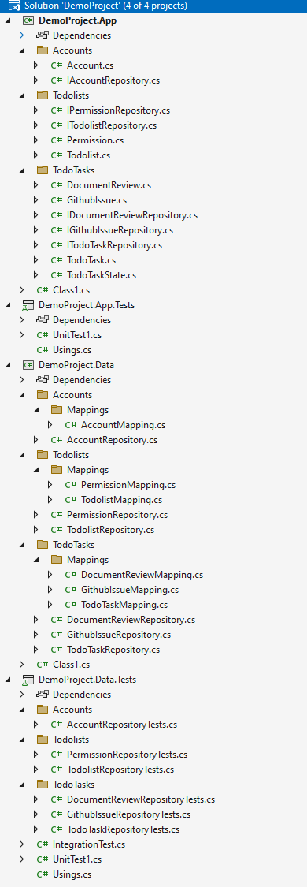
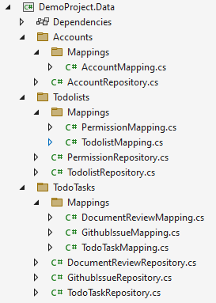
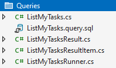

Introduction
===========

This article is about version 2.0 of my object/relation mapper and data mapper Griffin.Data and is divided into parts. 

* Part 1 - Why I created Griffin.Data.
* Part 2 - Scaffolding and inspecting the generated files.
* Part 3 - Adjusting the generated files.
* Part 4 - Building an application service using the generated code.
* Part 5 - Summary and links.

Before we get into the library itself, let's discuss my goals.

## The importance of encapsulation

First, let's talk about business entities, or domain entities as they are called in Domain Driven Design. Business entities are classes that ensure the busuiness logic is encapsulated and that changes are driven by behavior (invoking methods). 

This is a POCO (Plain Old CLR Object):

```csharp
public class Account
{
    public int Id { get; set; }
    public AccountState State { get; set; }
    public DateTime CreatedAt { get; set; }
    public DateTime? LockedAt { get; set; }
    public string UserName { get; set; }
    public string FirstName { get; set; }
    public string LastName { get; set; }
}
```

It has no control over its state; any part of the application can modify its properties without validation. For instance, one method can change the date fields without remembering to change the state and vice versa. That would produce an invalid state, which will make many any logic that uses both fields to produce ambiguous behavior (i.e., can't tell what the result will be as the combination is unexpected). Finding that kind of discrepancy is easy initially but quite challenging when the application is a couple of years old.

One way to remedy the above problem is to use encapsulation, which is one of the fundamental principles of OOP.

```csharp
public class Account
{
    public Account(string userName)
    {
        if (userName == null ) throw new ArgumentNullException(nameof(userName));

        State = AccountState.NotVerified;
        UserName = userName;
        CreatedAt = DateTime.Now;
    }

    public int Id { get; private set; }
    public AccountState State { get; private set; }
    public DateTime CreatedAt { get; private set; }
    public DateTime? LockedAt { get; private set; }
    public string UserName { get; private set; }
    public string FirstName { get; set; }
    public string LastName { get; set; }

    public void LockAccount()
    {
        State = AccountState.Locked;
        LockedAt = DateTime.Now;
    }

    public void UnlockAccount()
    {
        State = AccountState.Active;
        LockedAt = null;
    }
}
```

That change (making most setters private) forces you to add behavior to your classes and ensures that the `account` logic is in one place, no matter how old your application becomes.

That part also applies to collection properties. If you have an entity like this:

```csharp
public class Account
{
    public int Id { get; set; }
    public string Region { get; set; }
    public IList<Account> LinkedAccounts { get; private set; }
}
```

The account class has no control over which accounts are added or not as linked. That is, any part of the application can add or remove accounts, whether valid or not. 

A simple change can correct that:

```csharp
public class Account
{
    private List<Account> _accounts = new List<Account>();

    public int Id { get; set; }
    public string Region { get; set; }
    public IReadOnlyList<Account> LinkedAccounts => _Accounts;

    public void LinkAccount(Account linkedAccount)
    {
        if (linkedAccout.Region != Region)
        {
            throw new InvalidOperationexception("Only accounts in the same region may be linked");
        }

        _accounts.Add(linkedAccount);
    }
}
```

In that way, we still keep all the business logic within the same place which makes it easy to adjust in, even when the application is 10 years old.

If you physically prevent something (by using private setters and read-only collections), you cannot produce spaghetti over time as easily ;)

## Complexity

Many ORMs are quite large and complex. EF Core is a huge beast that tries to solve all possible problems in the data layer. My personal opinion is that EF Core is like WebForms. It tries to solve problems that isn't really there which really results in layers of indirection and additional complexity in your application.

With Griffin.Data I try to keep the runtime complexity as minimal as possible. __When something fails, it should be obvious why__; It should be easy to correct mistakes without spending a lot of time debugging.

The strive for minimal complexity also means that some design desicions are made. 

Griffin.Data does not support LINQ and never will. Instead, you have to use SQL. But in most cases you don't have to when working directly with business entities. When it comes to present information to users, you write SQL queries, but those are scaffolded into classes. In that way you do get type safety without LINQ. I'm also working on a SQL query analyzer that will detect errors in your SQL statements at compile time (as an alternative to LINQ type safety).

## Errors

Debugging the data layer can make event the most experiences developer highly frustrated. The data layer is infrastructure code. It doesn't solve the customers problem, right? It should just work.

Many ORMs provide vague error messages which makes it hard to tell what the root cause is. The more custom solutions you make, the harder it will be to debug it.

In Griffin.Data I've spent time to make sure that all error messages are rich and should give you enough information to dignaose and solve problems quickly.

Here are a few samples.

## Conclusion

If you agree with the above sentiments, you'll like Griffin.Data. If you don't, EF Core or NHibernate might better fit you.

# Part 2 - Enter Griffin.Data

Stop for a minute and reflect on what your data layer consists of.

What does your application need to do when your users want to change/save information? Is the typical flow to fetch an entity, modify it, and persist the changes? 

Is it enough to show details from a single table (like a `UserId` instead of a name) when your users want to view information? Or do you have to aggregate a result to make it more user-friendly?

The use cases for the data layer differ greatly depending on whether the read and write side of an application wants to do something.

Griffin.Data adheres to that. For the write side, there is an ORM, while for the read side, there is a scaffolder that uses SQL queries as a source

## Getting started

Many ORMs struggle with business entities. They require some sort of compromise, for instance forcing setters, default constructors, or properties that aren't part of the business domain. Unfortunately, those compromises violate proper encapsulation, which is essential in long-lived applications to keep up the development speed throughout the years.

Griffin.Data doesn't do that. Instead, it allows business entities to follow all encapsulation rules and well-defined business entities.

Let's build a TODO application that supports different types of tasks.

One task might be correcting a GitHub issue, while another might review a documentation file. A task for a github issue will contain a link to the issue, while a document review task will contain a document link and a feedback field.

To make a complete example, we've also added permissions to lists (to share lists) and accounts.

Finally, we want to see what has been changed and by whom.

```sql
create table Accounts
(
    Id int identity not null primary key,
    UserName varchar(40) not null,
    Password varchar(40) not null,
    Salt varchar(40) not null
);

create table Todolists
(
    Id int identity not null primary key,
    Name varchar(40) not null,
    CreatedById int not null constraint FK_Todolists_Accounts1 foreign key references Accounts(Id),
    CreatedAtUtc datetime not null,
    UpdatedById int constraint FK_Todolists_Accounts2 foreign key references Accounts(Id),
    UpdatedAtUtc datetime
);

create table TodolistPermissions
(
    Id int identity not null primary key,
    TodolistId int not null constraint FK_TodolistPermissions_Todolists foreign key references Todolists(Id),
    AccountId int not null constraint FK_TodolistPermissions_Accounts foreign key references Accounts(Id),
    CanRead bit not null,
    CanWrite bit not null,
    IsAdmin bit not null
);


create table TodoTasks
(
    Id int identity not null primary key,
    TodolistId int not null constraint FK_TodoTasks_Todolists foreign key references Todolists(Id),
    Name varchar(40) not null,
    TaskType int not null,
    State smallint not null,
    Priority int not null,
    CreatedById int not null constraint FK_Tasks_Accounts1 foreign key references Accounts(Id),
    CreatedAtUtc datetime not null,
    UpdatedById int constraint FK_Tasks_Accounts2 foreign key references Accounts(Id),
    UpdatedAtUtc datetime
);


create table TodoTaskGithubIssues
(
    TaskId int not null primary key constraint FK_TaskGithubIssues_TodoTasks foreign key references TodoTasks(Id),
    Name varchar(40) not null,
    IssueUrl int not null,
);

create table TodoTaskDocumentReviews
(
    TaskId int not null  primary key constraint FK_TaskDocumentReviews_TodoTasks foreign key references TodoTasks(Id),
    DocumentUrl varchar(255) not null,
    Comment text
);

```

## Scaffolding the write side (i.e. the business side)

Scaffolding is the process of generating code from a set of rules. Scaffolding is in no way required when using Griffin.Data, but it helps you to get to a starting point in your application quickly.
The idea with this scaffolder is that you take time to design a good database schema and ensure that it as efficient as required by your application requirements.

You can run the scaffolder multiple times (and choose to overwrite existing files).

Now that we have a simple data model let's scaffold it to get some code.

Start by installing the scaffolder through PowerShell or a command prompt.

```
dotnet install -g `Griffin.Data.Scaffolder`
```

`-g` means that it's only installed once (globally) and can be used in any of your projects to generate code.

For this article, I've created a solution with the following structure:


To get everything working, Griffin.Data needs to be installed in the Data and Data.Test projects.

Install the `Griffin.Data.SqlServer` nuget package in those projects.

```
dotnet add package Griffin.Data.SqlServer
```

Support is being added for MySQL, PostgreSQL, and Oracle. They are half-way done. Feel free to contribute :)

You now have everything required to generate the data layer. 

Open a command prompt (or the nuget package manager console) and run the following command:

```
dotnet gd generate
```

The scaffolder will examine all your projects to determine which ones to put the files in. It uses a couple of conventions documented in the [wiki](https://github.com/jgauffin/Griffin.Data/tree/master/docs/Scaffolding).

The scaffolder should have generated a couple of files now:



### Business layer

Your business layer has got the following type of files:

* Repository interfaces (to test your services without using a database, i.e. isolated tests).
* Domain classes (pure, encapsulated, without DB dependencies or compromises).
* Enums (all columns that end with `State` are interpreted as enums and get an enum generated for them).

Let's look at a sample from every category.

**Repository interface**

```csharp
using Griffin.Data.Domain;

namespace DemoProject.App.Todolists
{
    public interface IPermissionRepository : ICrudOperations<Permission>
    {
        Task<Permission> GetById(int id);

        /// <summary>
        ///     Create a new entity in the database.
        /// </summary>
        /// <param name="entity">Entity to create.</param>
        /// <returns>Task</returns>
        Task Create([DisallowNull] Permission entity);

        /// <summary>
        ///     Delete an existing entity from the database.
        /// </summary>
        /// <param name="entity">Entity to delete.</param>
        /// <returns>Task</returns>
        Task Delete([DisallowNull] Permission entity);

        /// <summary>
        ///     Update an existing entity in the database.
        /// </summary>
        /// <param name="entity">Entity to update.</param>
        /// <returns>Task</returns>
        Task Update([DisallowNull] Permission entity);
    }
}
```

* The `GetById()` method varies depending on whether the table has a composite key (i.e. a primary key consisting of multiple columns).

**Business entity**

Here is what a business entity looks like:

```csharp
namespace DemoProject.App.Todolists
{
    public class Permission
    {
        public Permission(int todolistId, int accountId, bool canRead, bool canWrite, bool isAdmin)
        {
            TodolistId = todolistId;
            AccountId = accountId;
            CanRead = canRead;
            CanWrite = canWrite;
            IsAdmin = isAdmin;
        }

        public int Id { get; private set; }
        public int TodolistId { get; private set; }
        public int AccountId { get; private set; }
        public bool CanRead { get; private set; }
        public bool CanWrite { get; private set; }
        public bool IsAdmin { get; private set; }

    }
}
```

**Features**

* All non-nullable fields are interpreted as mandatory and are therefore added to the constructor.
* Child entity lists are added as `IReadOnlyList<T>` not to violate Law of Demeter.
* All not-null properties are added as `private set` while all nullable properties have a public setter.

### Data layer

The data layer will contain a concrete repository implementation and the mappings required for `Griffin.Data` to translate between tables and columns. A translation is typically straightforward (i.e. an easy translation between tables and classes). But as development progresses, so does the schema and class structure. Having a mapping will ensure that any differences are mapped correctly.



Here is the mapping for the permission class:

```csharp
public class PermissionMapping : IEntityConfigurator<Permission>
{
    public void Configure(IClassMappingConfigurator<Permission> config)
    {
        config.TableName("TodolistPermissions");
        config.Key(x => x.Id).AutoIncrement();
        config.Property(x => x.TodolistId);
        config.Property(x => x.AccountId);
        config.Property(x => x.CanRead);
        config.Property(x => x.CanWrite);
        config.Property(x => x.IsAdmin);
    }
}
```

Now, since the table and column are identical, the following could have worked:


```csharp
public class PermissionMapping : IEntityConfigurator<Permission>
{
    public void Configure(IClassMappingConfigurator<Permission> config)
    {
        config.TableName("TodolistPermissions");
        config.Key(x => x.Id).AutoIncrement();
        config.MapRemainingProperties();
    }
}
```

`MapRemainingProperties()` will generate mappings for all non-configured properties.

However, looking at parent/child structures might be more interesting. Here is one example:

```csharp
public class TodoTaskMapping : IEntityConfigurator<TodoTask>
{
    public void Configure(IClassMappingConfigurator<TodoTask> config)
    {
        config.TableName("TodoTasks");
        config.Key(x => x.Id).AutoIncrement();
        config.Property(x => x.Name);
        config.Property(x => x.TaskType);
        config.Property(x => x.State);
        config.Property(x => x.Priority);
        config.Property(x => x.CreatedById);
        config.Property(x => x.CreatedAtUtc);
        config.Property(x => x.UpdatedById);
        config.Property(x => x.UpdatedAtUtc);
        config.HasMany(x => x.GithubIssues)
                .ForeignKey(x => x.TaskId)
                .References(x => x.Id);
        //config.HasOne(x => x.GithubIssue)
        //      .ForeignKey(x => x.TaskId)
        //      .References(x => x.Id);

        config.HasMany(x => x.DocumentReviews)
                .ForeignKey(x => x.TaskId)
                .References(x => x.Id);
        //config.HasOne(x => x.DocumentReview)
        //      .ForeignKey(x => x.TaskId)
        //      .References(x => x.Id);

    }
}
```

Since the scaffolder can't tell if there is a single child or multiple ones, it generates alternatives for both.

Parent/child relations are supported throughout the hierarchy (i.e. you can have parent -> child1 -> childOfChild1 -> childOfChildOfChild1). They are all fetched when you load the parent (unless you tell it not to load children).

**Repository** 

If you remember, I said that Griffin.Data works with the assumption that the read and write part of an application is separated. Repositories are for the write part (i.e., load an entity, modify and persist state changes).

As such, repositories are minimal. Since the CRUD methods are identical (for the most time), there is a base class in Griffin.Data that repositories can inherit.

```csharp
public class PermissionRepository : CrudOperations<Permission>, IPermissionRepository
{
    public PermissionRepository(Session session) : base(session)
    {
        if (session == null) throw new ArgumentNullException(nameof(session));
    }
    public async Task<Permission> GetById(int id)
    {
        return await Session.First<Permission>(new {id});
    }
}
```

**Integration tests**

Finally, we have the integration tests (i.e. tests for the data layer). They aim to ensure that the mappings work and that Griffin.Data fully supports your entities/tables.

The Scaffolder generates a base class to open a connection to your database.

All integration tests are made through the repository tests. 

```csharp
public class PermissionRepositoryTests : IntegrationTest
{
    private readonly PermissionRepository _repository;

    public PermissionRepositoryTests()
    {
        _repository = new PermissionRepository(Session);
    }

    [Fact]
    public async Task Should_be_able_to_insert_entity()
    {
        var entity = CreateValidEntity();

        await _repository.Create(entity);
        
        entity.Id.Should().BeGreaterThan(1);
    }

    [Fact]
    public async Task Should_be_able_to_update_entity()
    {
        var entity = CreateValidEntity();
        await Session.Insert(entity);

        await _repository.Update(entity);

        var actual = await Session.FirstOrDefault<Permission>(new {entity.Id});
        actual.Should().NotBeNull();
        actual.TodolistId.Should().Be(entity.TodolistId);
        actual.AccountId.Should().Be(entity.AccountId);
        actual.CanRead.Should().Be(entity.CanRead);
        actual.CanWrite.Should().Be(entity.CanWrite);
        actual.IsAdmin.Should().Be(entity.IsAdmin);
    }

    [Fact]
    public async Task Should_be_able_to_delete_entity()
    {
        var entity = CreateValidEntity();
        await Session.Insert(entity);
        
        await _repository.Delete(entity);

        var actual = await Session.FirstOrDefault<Permission>(new {entity.Id});
        actual.Should().BeNull();
    }

    private Permission CreateValidEntity()
    {
        var entity = new Permission(1736271703, 1929237965, true, true, true);
        return entity;
    }

}
```

The test classes are generated so there is a single point that you need to change to adjust for value restrictions, and that's the `CreateValidEntity` method.

## Scaffolding the read side (i.e. the presentation side)

The read side of an application is used to present information for users in a human-friendly name. Just listing the `Task.CreateById` number for a user won't cut it ;) Unlike machines, a name is required.

Therefore, most information presented for puny humans is generated by joining or aggregating data from multiple tables. Trying to support that will cause a complex ORM that will be hard to maintain or use in complex scenarios. As mentioned before, Griffin.Data takes another approach. Everything that should be presented to the user is generated from pure SQL queries.

First, create a query (simple one for the sake of the article):

```sql
declare @accountId int = 10;

select t.Name Todolist, tt.*
FROM Todolists t
join TodolistPermissions tp on (tp.TodolistId = t.Id)
join todotasks tt ON (tt.TodolistId = t.Id)
WHERE tp.AccountId = @accountId
ORDER by tt.Priority
```

Save it in your dataproject with the name `SomeComplexQuery.query.sql`. The `.query.sql` part is essential so the scaffolder can pick it up.

Then run the scaffolder:

```
dotnet gd queries
```

It will now generate a query, a query result and a query invoker.



Since queries represent a snapshot of time in the application, there is no need to use encapsulation. Therefore, all generated classes are plain DTOs.

**Query**

```csharp
public class ListMyTasks : IQuery<ListMyTasksResult>
{
    public int AccountId { get; set; }
}
```

**Query result**

```csharp
public class ListMyTasksResult
{
    public IReadOnlyList<ListMyTasksResultItem> Items { get; set; }
}
```

**Query result item**

```csharp
public class ListMyTasksResultItem
{
    public string Todolist { get; set; }
    public int Id { get; set; }
    public int TodolistId { get; set; }
    public string Name { get; set; }
    public int TaskType { get; set; }
    public short State { get; set; }
    public int Priority { get; set; }
    public int CreatedById { get; set; }
    public DateTime CreatedAtUtc { get; set; }
    public int UpdatedById { get; set; }
    public DateTime UpdatedAtUtc { get; set; }
}
```

**Query invoker** 

```csharp

```


You can also instruct the scaffolder to generate code for paging and sorting like this:

```
--paging
--sorting
declare @accountId int = 10;

select t.Name Todolist, tt.*
FROM Todolists t
join TodolistPermissions tp on (tp.TodolistId = t.Id)
join todotasks tt ON (tt.TodolistId = t.Id)
WHERE tp.AccountId = @accountId
ORDER by tt.Priority
```

The first to lines are SQL comments that tells the scaffolder to add sorting and paging.

### Invoking queries

A query is invoked through the query invoker:

```csharp
var query = new ListMyTasks()
                .Paging(1, 10)
                .OrderBy(x => x.Name)
                .OrderByDescending(x => x.Priority);

var result = await _queryInvoker.Query(query);
```

Queries are designed as DTOs so that you should be able to use them through API end points (with for instance JSON serialization).


## Part 3 - Adjusting the generated files

When we designed the database, we wanted task to be able to contain different types of information depending on the task type. As it's not possible for the scaffolder to understand that, we need to edit the generated class.

The first thing to do is to define a base type. In this case we'll define a base interface.

```csharp
public interface ITaskData
{
    int TaskId { get; }
}
```

Next, we'll adjust the `GithubIssue` and `DocumentReview` classes so that they implement the interface:


```csharp
public class GithubIssue : ITaskData
{
    public GithubIssue(string name, int issueUrl)
    {
        Name = name;
        IssueUrl = issueUrl;
    }

    // The foreign key will be set by Griffin.Data.
    public int TaskId { get; private set; }

    public string Name { get; private set; }
    public int IssueUrl { get; private set; }
}
```

Finally we add a `Data` property to the Task class and remove the lists.

```csharp
public class TodoTask
{
    public TodoTask(int todolistId, string name, TaskType taskType, TodoTaskState state, int priority, int createdById)
    {
        TodolistId = todolistId;
        Name = name;
        TaskType = taskType;
        State = state;
        Priority = priority;
        CreatedById = createdById;
        CreatedAtUtc = DateTime.UtcNow;
    }

    // [.. other properties ..]
 

    // Let's keep the taskType as int,
    // could have switched to enum.
    public int TaskType { get; private set; }

    // The tast
    public ITaskData Data { get; set; }

}

```

Now, we have to configure Griffin.Data so it understands how to create the correct child type.

```csharp
public class TodoTaskMapping : IEntityConfigurator<TodoTask>
{
    public void Configure(IClassMappingConfigurator<TodoTask> config)
    {
        // This line can be removed. 
        // The convention uses plural of the class name as table name.
        config.TableName("TodoTasks");

        config.Key(x => x.Id).AutoIncrement();

        // We want to have one child,
        // and since it can come from either
        // the table TodoTaskGithubIssues and the table
        // TodoTaskDocumentReview.
        config.HasOne(x=>x.Data)
            .Discriminator(x => x.TaskType, SelectChildType)
            .ForeignKey(x => x.TaskId)
            .References(x => x.Id);

        config.MapRemainingProperties();
    }

    private static Type SelectChildType(int taskType)
    {
        return taskType switch
        {
            // Note that "TodoTask" from the table name
            // was automatically removed when the classes
            // where scaffolded.
            0 => typeof(DocumentReview),
            1 => typeof(GithubIssue),
            _ => throw new ArgumentOutOfRangeException(nameof(taskType), taskType, "Unknown task type.")
        };
    }
}
```

That's all. Each `TodoTask` will now get the correct entity loaded from the correct child table.

```csharp
var task = _session.GetById<TodoTask>(1);
if (task.Data is GithubIssue gi)
{
    Console.WriteLine($"Issue to complete: {gi.IssueUrl}.");
}
```

# Part 4 - Building application services

Before building an application service, we need to configure Griffin.Data.

The below code scans the assembly that the class 'TodoTaskMapping' is located in, activates snapshot change tracking and uses MS SQL Server.

```csharp
// A config from Microsoft.Extensions.Configuration
var connectionString = config.GetConnectionString("Db");

// The DB configuration.
var dbConfig = new DbConfiguration(configurationString)
    .AddMappingAssembly(typeof(TodoTaskMapping).Assembly)
    .UseSnapshotChangeTracking()
    .UseSqlServer();

var session = new Session(config);
```

Now that everything is configured, let's try to fetch entities, for instance by searching for a user:

```csharp
var entities = session.List<Account>(new { UserName = 'G%' });
```

You can read more about all ways that you get retrieve entities in the [github wiki](https://github.com/jgauffin/Griffin.Data/blob/master/docs/Querying/Querying.md).


If no errors where made


Without change tracking, all changes have to be applied manually:

```csharp
var entity = Session.GetById<Account>(userId);
entity.LockAccount();
entity.Manager = new LinkedAccount(otherAccount);

// These two lines are required since change tracking is not used.
Session.Update(entity);
Session.Insert(entity.Manager);

Session.SaveChanges();
```

With change tracking, it's easier:

```csharp
var entity = Session.GetById<Account>(userId);
entity.LockAccount();
entity.Manager = new LinkedAccount(otherAccount);

Session.SaveChanges();
```

# Part 5 - Summary and links

I hope that you enjoyed this article and are eager to try Griffin.Data.

All code from this article is found in the "Demo" folder in github. Create the database and then run the demo to try everything out. My intention is to  make a complete TODO application to demonstrate how I think that Griffin.Data should be used (and a structure of an application).

Most features are documented in the [wiki](https://github.com/jgauffin/Griffin.Data/tree/master/docs) if you want to learn more. Feel free to create an github issue with the documentation is missing something.

