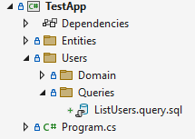

Queries
=======

Use queries to generate information from one or multiple tables, such as on the read side of CQRS.

Build the query classes manually, or use the recommended approach: The scaffolder in this library takes SQL query files and generates classes based on them.

# Create a new query.

Here is an example of the process of generating queries.

In this case, we'll create a query that returns all active users.

## Write a SQL query

Use SQL Management Studio (or your favorite SQL IDE) and write a nice query.

Here is a minimal example:

```sql
SELECT u.Id, UserName
FROM Users u
JOIN Accounts a ON (u.AccountId = a.Id)
WHERE a.State = 1;
```

## Save the query in a file in your project

Copy/paste the query into a new script in your database project.

It can be named `ListActiveUsers.query.sql`:



The `.query.sql` part is important as it tells the scaffolder to generate a new script.

## Run the scaffolder

Open a command prompt or powershell and run the scaffolder (install it first using `dotnet tool install -g griffin.data.scaffolding`).

```
dotnet gd queries
```

It will now generate all files.


## View the result

There is now a couple of classes in the same folder as the query script.

```csharp
// It's empty since no parameters were supplied. 
// It does, however, specify the type it will return, `ListActiveUsersResult`.
public class ListActiveUsers : IQuery<ListActiveUsersResult>
{
}

// The result returned from the query handler.
public class ListActiveUsersResult
{
    public IReadOnlyList<ListActiveUsersResultItem> Items { get; set; }
}

// The result item with details.
public class ListActiveUsersResultItem
{
    public int Id  { get; set; }
    public string UserName  { get; set; }
}

// The query runner (which executes the query and generates the result).
public class ListUsersRunner : ListRunner<ListUsersResultItem>, IQueryRunner<ListUsers, ListUsersResult>
{
    public ListUsersRunner(Session session) : base(session)
    {
    }

    public async Task<ListUsersResult> Execute(ListUsers query)
    {
        await using var command = Session.CreateCommand();
        command.CommandText = @"select *
                                 from Users";

        command.AddParameter("name", query.NameToFind);
        return new ListUsersResult { Items = await MapRecords(command) };
    }

    protected override void MapRecord(IDataRecord record, ListUsersResultItem item)
    {
        item.Id = record.GetInt32(0);
        item.UserName = record.GetString(1);
    }
}
```

The generated query uses regular ADO.NET to avoid mapping issues or inefficiencies. 

## Invoke it

Use the' Session' class to invoke the query to get a result.

```csharp
var result = await Session.Query(new ListActiveUsers());
```

## Update or regenerate

To update it, modify it. The scaffolder will not do anything with existing files. 

If more extensive changes are made, adjust the SQL file and then delete all classes to get it re-generated.


# Using query parameters

Query parameters in the SQL script are automatically converted into query properties.

```sql
declare @nameToFind varchar(40) = 'TestName';

SELECT u.Id, UserName
FROM Users u
JOIN Accounts a ON (u.AccountId = a.Id)
WHERE u.UserName LIKE @name
```

The above query results in

```csharp
public class ListActiveUsers : IQuery<ListActiveUsersResult>
{
    public string NameToFind { get; set; }
}
```

# Paging

To use paging, simply add `--paging` to the first line of the SQL script.

```sql
--paging
declare @nameToFind varchar(40) = 'TestName';

SELECT u.Id, UserName
FROM Users u
JOIN Accounts a ON (u.AccountId = a.Id)
WHERE u.UserName LIKE @name
```

```csharp
public class ListActiveUsers : IQuery<ListActiveUsersResult>
{
    public string NameToFind { get; set; }
    public int PageNumber { get; private set; } = 1;
    public int PageSize { get; private set; } = 50;

    public void Page(int pageNumber, int pageSize)
    {
        if (pageNumber <= 0) 
        {
            throw new ArgumentExcpetion("PageNumber is a one-based index");
        }

        PageNumber = pageNumber;
        PageSize = pageSize;
    }
}
```

# Sorting

To allow the query invoker to sort the result, add `--sorting` to the top of the query.

```sql
--sorting
--paging
declare @nameToFind varchar(40) = 'TestName';

SELECT u.Id, UserName
FROM Users u
JOIN Accounts a ON (u.AccountId = a.Id)
WHERE u.UserName LIKE @name
```

```csharp
public class ListActiveUsers : IQuery<ListActiveUsersResult>
{
    private List<QuerySort> _sorting = new List<QuerySort>();

    public string NameToFind { get; set; }
    public int PageNumber { get; private set; } = 1;
    public int PageSize { get; private set; } = 50;
    public IReadOnlyList<QuerySort> Sorting { get { return _sorting; } private set { _sorting = new List<QuerySort>(value); } }

    public ListActiveUsers Page(int pageNumber, int pageSize)
    {
        if (pageNumber <= 0) 
        {
            throw new ArgumentExcpetion("PageNumber is a one-based index");
        }

        PageNumber = pageNumber;
        PageSize = pageSize;
        return this;
    }
    
    public ListActiveUsers SortAscending(string propertyName)
    {
        _sorting.Add(new QuerySort(propertyName, true));
        return this;
    }
    public ListActiveUsers SortDescending(string propertyName)
    {
        _sorting.Add(new QuerySort(propertyName, false));
        return this;
    }
}
```

Use the generated query like this:

```csharp
var query = new ListActiveUsers('jo%")
    .Page(2, 20)
    .SortAscending("Id")
    .SortDescending("Name");

var result = await Session.Query(query);
```
